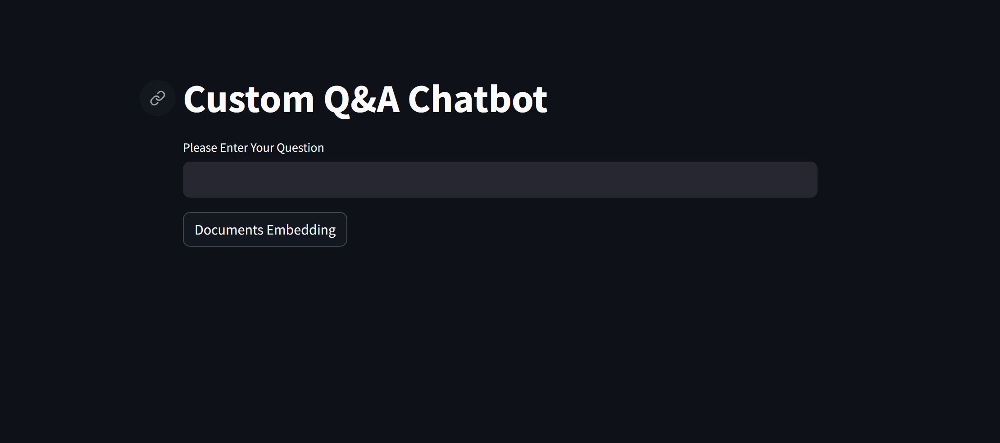

# Custom Compliance Q&A Chatbot - GenAI

Custom Compliance Q&A Chatbot: Tailored Information Retrieval Aligned with Organizational Protocols| GenAI, LLM, Machine Learning
•	Developed an innovative chatbot capable of parsing and answering complex queries adhering to company protocol and documentation, leveraging Llama3, Langchain, streamlit, and Groq API for precise information retrieval and real-time response generation.


This repository provides a Custom Compliance Q&A Chatbot built using Streamlit, LangChain, Groq API, and OpenAI's embedding models. The chatbot employs document embedding and retrieval techniques to answer user questions based on a given set of documents. 

## Features
- **Custom Q&A Interface:** A user-friendly Streamlit-based interface where users can input questions and receive contextually accurate answers.
- **Document Embedding and Retrieval:** Uses OpenAI's embeddings to build a vector database that allows for efficient document retrieval and similarity searches.
- **LLM-Powered Responses:** Leverages powerful large language models (LLMs) like Llama3 to generate high-quality, relevant answers.
- **Prompt-Based QA:** Utilizes prompt templates to instruct the LLM to generate responses solely based on the provided context.

## Technical Implementation
- **LangChain:** This chatbot leverages LangChain's `ChatGroq` and `OpenAIEmbeddings` for embedding models and question-answering chains.
- **Document Loading and Splitting:** Documents are ingested via LangChain's `PyPDFDirectoryLoader`, split using `RecursiveCharacterTextSplitter`, and stored using the FAISS vector store.
- **Prompt Templates:** A `ChatPromptTemplate` structures the queries passed to the LLM, ensuring answers are derived strictly from the provided documents.
- **Retrieval Chain:** The system retrieves relevant document chunks using FAISS-based embeddings and uses a chain to generate precise responses.

## Setup Instructions
1. **Clone the Repository:** Clone this repository to your local machine.
2. **Install Dependencies:** Make sure you have Python installed, then run:
    ```bash
    pip install -r requirements.txt
    ```
3. **API Keys:** Add your API keys for OpenAI and GROQ to a `.env` file as follows:
    ```env
    OPENAI_API_KEY=your_openai_key
    GROQ_API_KEY=your_groq_key
    ```
4. **Data Preparation:** Place your documents in the `./doc` folder to ensure proper ingestion.
5. **Start the App:** Launch the Streamlit app using:
    ```bash
    streamlit run app.py
    ```
6. **Embed Documents:** Click on the "Documents Embedding" button to process and embed the documents.
7. **Ask Questions:** Input your question, and the chatbot will provide a response based on the retrieved document context.

## How It Works
- **Document Embedding:** Click the "Documents Embedding" button to initiate the ingestion and vectorization process.
- **Question-Answer Flow:** When a question is submitted, the chatbot retrieves relevant chunks using similarity search and then uses the LLM to answer based on the retrieved context.
- **Document Similarity:** Users can expand to view the document sections that were relevant to the chatbot's answers.

Enjoy using this customizable chatbot for all your specialized Q&A needs!

